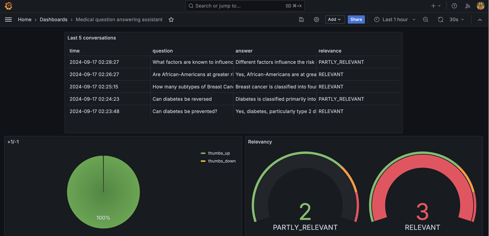

# Medical Question Answering Assistant

<p align="center">
  
</p>


## Overview
The goal of this project is to create an AI-driven medical question answering system that uses the MedQuAD dataset as the knowledge base. The model is trained to handle various medical inquiries from patients and healthcare professionals, aiming to improve access to high-quality medical information.

Medical question answering (QA) datasets are crucial for several reasons, especially in the context of advancing healthcare, improving AI applications, and supporting medical professionals. Here’s why they are important:

### 1. Training AI Models for Healthcare
Medical QA datasets are used to train machine learning and natural language processing (NLP) models. These models help in developing AI systems capable of answering medical questions, ranging from basic health inquiries to complex medical diagnoses. Well-structured datasets allow AI models to learn from verified medical sources and generate reliable and accurate responses.

### 2. Supporting Clinical Decision-Making
In clinical settings, physicians and other healthcare professionals often need quick access to reliable medical information. Medical QA systems trained on high-quality datasets can help in providing evidence-based responses, supporting doctors in making informed decisions quickly, especially in time-sensitive scenarios.

### 3. Improving Patient Engagement and Health Literacy
Medical QA datasets enable the creation of AI-powered tools that can answer patients' questions regarding symptoms, conditions, and treatments. This helps improve health literacy by providing patients with accessible, understandable, and trustworthy information.

### 4. Reducing Workload for Healthcare Providers 
With AI systems that can answer common medical questions, healthcare providers can reduce the burden of answering routine queries from patients, allowing them to focus on more complex cases and improving efficiency in healthcare delivery.

## Project overview

The Medical Question Answering Assistant is a RAG application designed to assist users in exploring the MedQuad dataset, which contains information about thousands of diseases, including their symptoms, causes and treatment. It can aswer a variety of questions with great accuracy.

The main use cases include:

1. Providing the definition of a given disease.
2. Describing the symptoms of a given disease.
3. Explaining treatment options for a disease.
4. Answering whether a given disease is preventable, and if so, how?
5. Describing how a given disease is diagnosed.
6. Answering which subpopulations are at greater risk for a given disease.
7. Explaining the different subtypes fo a given disease (e.g. breast cancer).
8. Describing ongoing clinical trials for a given disease (e.g. the TAILORx trial in breast cancer treatment).


The Medical Questions Answering Assistant provides a conversational AI that helps users learn about various diseases, their symptoms, causes, and treatment etc.

This project was implemented for [LLM Zoomcamp](https://github.com/DataTalksClub/llm-zoomcamp) - a free course about LLMs and RAG.

## Dataset
The **MedQuAD** dataset is a publicly available medical question-answering dataset developed by the **U.S. National Library of Medicine**. It includes more than **47,000 questions** across diverse medical domains such as conditions, drugs, procedures, genetics, and diagnostics. 

### MedQuAD Dataset Characteristics:
- **Source of Questions:** National Institutes of Health (NIH) websites.
- **Domains Covered:** Diseases, treatments, drugs, procedures, genetics.
- **Language:** English.

The dataset has been downloaded from Kaggle:

https://www.kaggle.com/datasets/jpmiller/layoutlm?select=medquad.csv

and is available in the data folder (data/medquad.csv).

The dataset and the associated study are described in detail at

https://github.com/abachaa/MedQuAD

and at the [official MedQuAD page](https://lhncbc.nlm.nih.gov/project/medquad).

## Technologies

- Python 3.12
- Docker and Docker Compose for containerization
- [Minsearch](https://github.com/alexeygrigorev/minsearch) for full-text search
- Flask as the API interface (see [Background](#background) for more information on Flask)
- Grafana for monitoring and PostgreSQL as the backend for it
- OpenAI as an LLM

## Preparation

Since we use OpenAI, you need to provide the API key:

1. Install `direnv`. If you use Ubuntu, run `sudo apt install direnv` and then `direnv hook bash >> ~/.bashrc`.
2. Copy `.envrc_template` into `.envrc` and insert your key there.
3. For OpenAI, it's recommended to create a new project and use a separate key.
4. Run `direnv allow` to load the key into your environment.

For dependency management, we use pipenv, so you need to install it:

```bash
pip install pipenv
```

Once installed, you can install the app dependencies:

```bash
pipenv install --dev
```

## Running the application


### Database configuration

Before the application starts for the first time, the database
needs to be initialized.

First, run `postgres`:

```bash
docker-compose up postgres
```

Then run the [`db_prep.py`](medical_question_answering_assistant/db_prep.py) script:

```bash
pipenv shell

cd medical_question_answering_assistant

export POSTGRES_HOST=localhost
python db_prep.py
```

To check the content of the database, use `pgcli` (already
installed with pipenv):

```bash
pipenv run pgcli -h localhost -U your_username -d course_assistant -W
```

You can view the schema using the `\d` command:

```sql
\d conversations;
```

And select from this table:

```sql
select * from conversations;
```

### Running with Docker-Compose

The easiest way to run the application is with `docker-compose`:

```bash
docker-compose up
```

### Running locally

If you want to run the application locally,
start only postres and grafana:

```bash
docker-compose up postgres grafana
```

If you previously started all applications with
`docker-compose up`, you need to stop the `app`:

```bash
docker-compose stop app
```

Now run the app on your host machine:

```bash
pipenv shell

cd medical_question_answering_assistant

export POSTGRES_HOST=localhost
python app.py
```

### Running with Docker (without compose)

Sometimes you might want to run the application in
Docker without Docker Compose, e.g., for debugging purposes.

First, prepare the environment by running Docker Compose
as in the previous section.

Next, build the image:

```bash
docker build -t medical_QandA_assistant .
```

And run it:

```bash
docker run -it --rm \
    --network="medical_QandA_assistant_default" \
    --env-file=".env" \
    -e OPENAI_API_KEY=${OPENAI_API_KEY} \
    -e DATA_PATH="data/medquad.csv" \
    -p 5000:5000 \
    medical_QandA_assistant
```

### Time configuration

When inserting logs into the database, ensure the timestamps are
correct. Otherwise, they won't be displayed accurately in Grafana.

When you start the application, you will see the following in
your logs:

```
Database timezone: Etc/UTC
Database current time (UTC): 2024-08-24 00:43:12.169624+00:00
Database current time (America/New_York): 2024-08-24 20:43:12.169624+02:00
Python current time: 2024-08-24 20:43:12.170246+02:00
Inserted time (UTC): 2024-08-24 00:43:12.170246+00:00
Inserted time (America/New_York): 2024-08-24 20:43:12.170246+02:00
Selected time (UTC): 2024-08-24 00:43:12.170246+00:00
Selected time (America/New_York): 2024-08-24 20:43:12.170246+02:00
```

Make sure the time is correct.

You can change the timezone by replacing `TZ` in `.env`.

On some systems, specifically WSL, the clock in Docker may get
out of sync with the host system. You can check that by running:

```bash
docker run ubuntu date
```

If the time doesn't match yours, you need to sync the clock:

```bash
wsl

sudo apt install ntpdate
sudo ntpdate time.windows.com
```

Note that the time is in UTC.

After that, start the application (and the database) again.


## Using the application

When the application is running, we can start using it.

### CLI

We built an interactive CLI application using
[questionary](https://questionary.readthedocs.io/en/stable/).

To start it, run:

```bash
pipenv run python cli.py
```

You can also make it randomly select a question from
[our ground truth dataset](data/ground-truth-retrieval.csv):

```bash
pipenv run python cli.py --random
```

### Using `requests`

When the application is running, you can use
[requests](https://requests.readthedocs.io/en/latest/)
to send questions—use [test.py](test.py) for testing it:

```bash
pipenv run python test.py
```

It will pick a random question from the ground truth dataset
and send it to the app.

### CURL

You can also use `curl` for interacting with the API:

```bash
URL=http://localhost:5000
QUESTION="What are the main causes of glaucoma and how does it develop over time?"
DATA='{
    "question": "'${QUESTION}'"
}'

curl -X POST \
    -H "Content-Type: application/json" \
    -d "${DATA}" \
    ${URL}/question
```

You will see something like the following in the response:

```json
{
    "answer": "To help prevent hypertension, you should engage in at least 150 minutes of physical activity weekly. This recommendation aligns with studies showing that regular physical activity can contribute to overall heart health and help manage blood pressure.",
    "conversation_id": "4e1cef04-bfd9-4a2c-9cdd-2771d8f70e4d",
    "question": "How much physical activity should I engage in weekly to help prevent hypertension?"
}
```

Sending feedback:

```bash
ID="4e1cef04-bfd9-4a2c-9cdd-2771d8f70e4d"
URL=http://localhost:5000
FEEDBACK_DATA='{
    "conversation_id": "'${ID}'",
    "feedback": 1
}'

curl -X POST \
    -H "Content-Type: application/json" \
    -d "${FEEDBACK_DATA}" \
    ${URL}/feedback
```

After sending it, you'll receive the acknowledgement:

```json
{
    "message": "Feedback received for conversation 4e1cef04-bfd9-4a2c-9cdd-2771d8f70e4d: 1"
}
```

## Code

The code for the application is in the [`medical_question_answering_assistant`](medical_question_answering_assistant/) folder:

- [`app.py`](medical_question_answering_assistant/app.py) - the Flask API, the main entrypoint to the application
- [`rag.py`](medical_question_answering_assistant/rag.py) - the main RAG logic for building the retrieving the data and building the prompt
- [`ingest.py`](medical_question_answering_assistant/ingest.py) - loading the data into the knowledge base
- [`minsearch.py`](medical_question_answering_assistant/minsearch.py) - an in-memory search engine
- [`db.py`](medical_question_answering_assistant/db.py) - the logic for logging the requests and responses to postgres
- [`db_prep.py`](medical_question_answering_assistant/db_prep.py) - the script for initializing the database

We also have some code in the project root directory:

- [`test.py`](test.py) - select a random question for testing
- [`cli.py`](cli.py) - interactive CLI for the APP

### Interface

We use Flask for serving the application as an API.

Refer to the ["Using the Application" section](#using-the-application)
for examples on how to interact with the application.

### Ingestion

The ingestion script is in [`ingest.py`](medical_question_answering_assistant/ingest.py).

Since we use an in-memory search engine, `minsearch`, to index and search our knowledge base, we run the ingestion script at the startup of the application.

It's executed inside [`rag.py`](medical_question_answering_assistant/rag.py) when we import it.

## Experiments

For experiments, we use Jupyter notebooks.
They are in the [`notebooks`](notebooks/) folder.

To start Jupyter, run:

```bash
cd notebooks
pipenv run jupyter notebook
```

We have the following notebooks:

- [`rag-test.ipynb`](notebooks/rag-test.ipynb): The RAG flow and evaluating the system.
- [`evaluation-data-generation.ipynb`](notebooks/evaluation-data-generation.ipynb): Generating the ground truth dataset for retrieval evaluation.

Please be aware that running the notebooks will cost money (approx. $10 - $15), especially if you use gpt-40. Using only gpt-40-mini should keep the costs in the $2-$3 range.

### Retrieval evaluation

The basic approach - using `minsearch` without any boosting - gave the following metrics:

- Hit rate: 79.65%
- MRR: 40.16%

The improved version (with tuned boosting):

- Hit rate: 85.87%
- MRR: 47.43%

The best boosting parameters:

```python
boost = {
    'question': 0.3417604466420481,
    'answer': 1.8419912735713542,
    'source': 0.25631365201530965,
    'focus_area': 0.22228140744464786
}
```

### RAG flow evaluation

We used the LLM-as-a-Judge metric to evaluate the quality of our RAG flow.

For `gpt-4o-mini`, in a sample with 200 records, we had:

- 185 (92.50%) `RELEVANT`
- 9 (4.50%) `PARTLY_RELEVANT`
- 6 (3.0%) `NON_RELEVANT`

We also tested `gpt-4o`:

- 188 (94%) `RELEVANT`
- 6 (3%) `PARTLY_RELEVANT`
- 6 (3%) `NON_RELEVANT`

The difference is minimal (only 1.5% more relevant, and the same percentage - 3% - for irrelevant responses), so we opted for `gpt-4o-mini`, which is substantially more cost-effective.

## Monitoring

We use Grafana for monitoring the application. 

It's accessible at [localhost:3000](http://localhost:3000):

- Login: "admin"
- Password: "admin"

### Dashboards

<p align="center">
  
</p>

The monitoring dashboard contains several panels:

1. **Last 5 Conversations (Table):** Displays a table showing the five most recent conversations, including details such as the question, answer, relevance, and timestamp. This panel helps monitor recent interactions with users.
2. **+1/-1 (Pie Chart):** A pie chart that visualizes the feedback from users, showing the count of positive (thumbs up) and negative (thumbs down) feedback received. This panel helps track user satisfaction.
3. **Relevancy (Gauge):** A gauge chart representing the relevance of the responses provided during conversations. The chart categorizes relevance and indicates thresholds using different colors to highlight varying levels of response quality.
4. **OpenAI Cost (Time Series):** A time series line chart depicting the cost associated with OpenAI usage over time. This panel helps monitor and analyze the expenditure linked to the AI model's usage.
5. **Tokens (Time Series):** Another time series chart that tracks the number of tokens used in conversations over time. This helps to understand the usage patterns and the volume of data processed.
6. **Model Used (Bar Chart):** A bar chart displaying the count of conversations based on the different models used. This panel provides insights into which AI models are most frequently used.
7. **Response Time (Time Series):** A time series chart showing the response time of conversations over time. This panel is useful for identifying performance issues and ensuring the system's responsiveness.

### Setting up Grafana

All Grafana configurations are in the [`grafana`](grafana/) folder:

- [`init.py`](grafana/init.py) - for initializing the datasource and the dashboard.
- [`dashboard.json`](grafana/dashboard.json) - the actual dashboard (taken from LLM Zoomcamp without changes).

To initialize the dashboard, first ensure Grafana is
running (it starts automatically when you do `docker-compose up`).

Then run:

```bash
pipenv shell

cd grafana

# make sure the POSTGRES_HOST variable is not overwritten 
env | grep POSTGRES_HOST

python init.py
```

Then go to [localhost:3000](http://localhost:3000):

- Login: "admin"
- Password: "admin"

When prompted, keep "admin" as the new password.

## Background

Here we provide background on some tech not used in the
course and links for further reading.

### Flask

We use Flask for creating the API interface for our application.
It's a web application framework for Python: we can easily
create an endpoint for asking questions and use web clients
(like `curl` or `requests`) for communicating with it.

In our case, we can send questions to `http://localhost:5000/question`.

For more information, visit the [official Flask documentation](https://flask.palletsprojects.com/).


## Acknowledgements 

I would like to thank Alexey Grigorev and the team of instructors who taught this wonderful course on LLMs and LLMOPs. This project relies heavily on Alexey's example project (https://github.com/alexeygrigorev/fitness-assistant/tree/main). I would also like to thank all fellow participants in the LLM Zoomcamp course for the generous exchange of knowledge and encouragement, the creators of the MedQuAD dataset, and creators of all the tools which were used in implementing this project.
